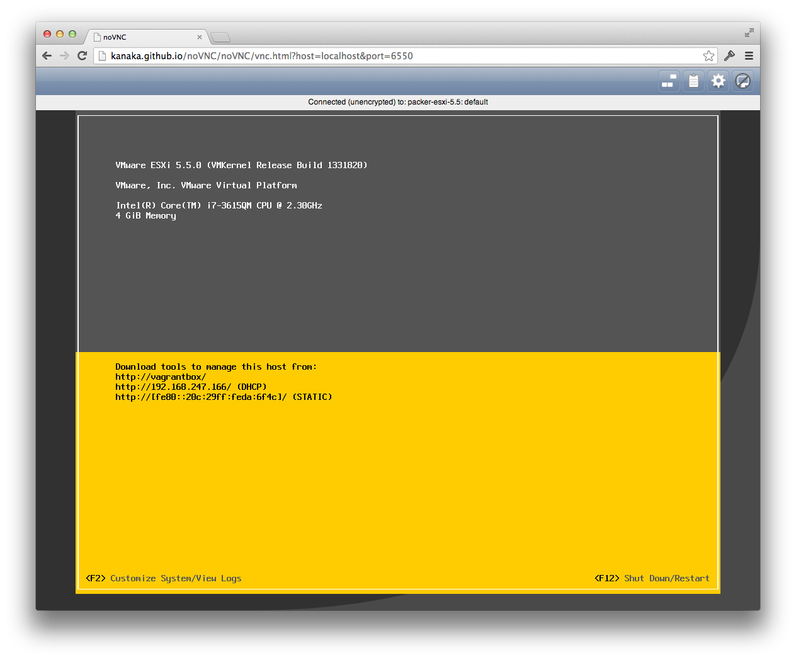

# Example Packer template and Vagrant box for VMware ESXi images

This repository contains a [Packer](http://packer.io) template for building
ESXi 5.5 machine images and a [Vagrant](http://vagrantup.com) box example.

## Requirements

* MacOSX with VMware Fusion or Linux with VMware Workstation

* [Packer](http://www.packer.io/intro/getting-started/setup.html)

* [Vagrant](http://docs.vagrantup.com/v2/installation/)

* [Vagrant plugin](http://www.vagrantup.com/vmware) for Fusion or Workstation

* VMware-VMvisor-Installer-5.5.0-1331820.x86_64.iso

## Packer image builder

You'll need a copy of VMware-VMvisor-Installer-5.5.0-1331820.x86_64.iso in this
directory, or add a valid url to `iso_urls` in `template.json`.

To build the image, run the following:

```
$ packer build template.json
```

While ESXi is installing, the console can be accessed using
[noVNC](http://novnc.com?host=localhost&port=6550).  The port can also be
changed with the `RemoteDisplay.vnc.webSocket.port` property in `template.json`.

## Vagrant box example

Install the vagrant [plugin](https://github.com/dougm/vagrant-esxi) for VMware
ESXi guest support:

```
$ vagrant plugin install vagrant-esxi
```

The packer build created a Vagrant box named `vmware_esxi55.box` in this
directory.  To bring up an instance of this box, run the following:

```
$ vagrant up --provider=vmware_fusion
```

The `provision.sh` script is run within the ESXi VM and changes /etc/motd with
the vagrant version sourced from this directory over NFS:

```
$ vagrant ssh
Welcome to VMware ESXi 5.5.0, up'd by Vagrant 1.3.4
```

The same noVNC url above can used to view the console:


